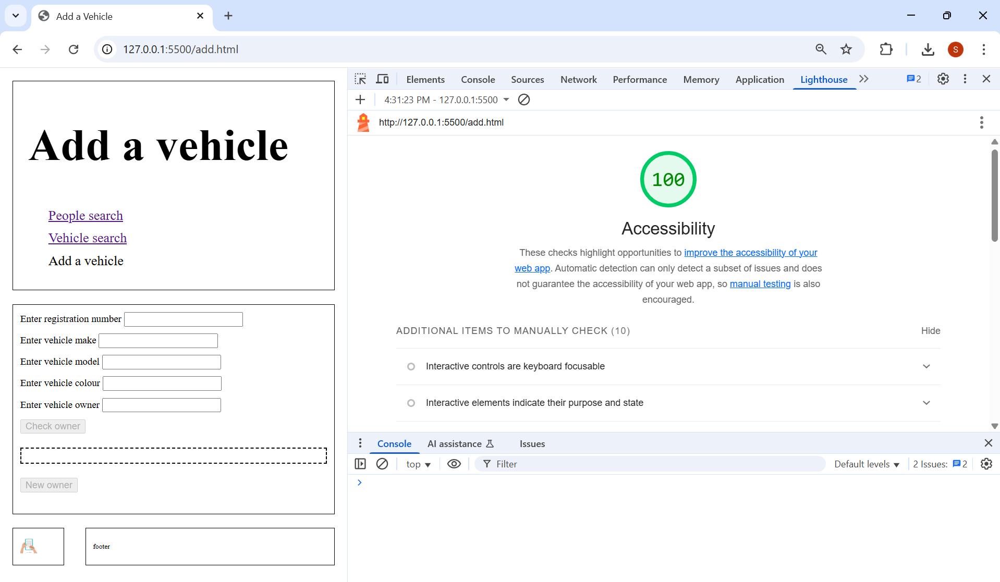
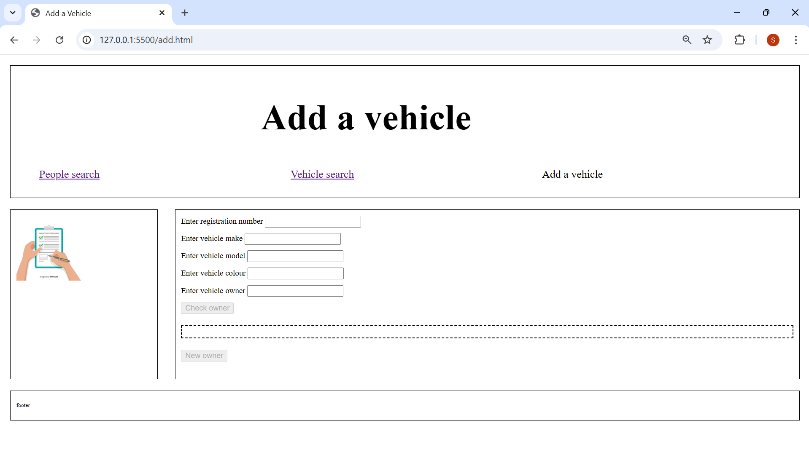
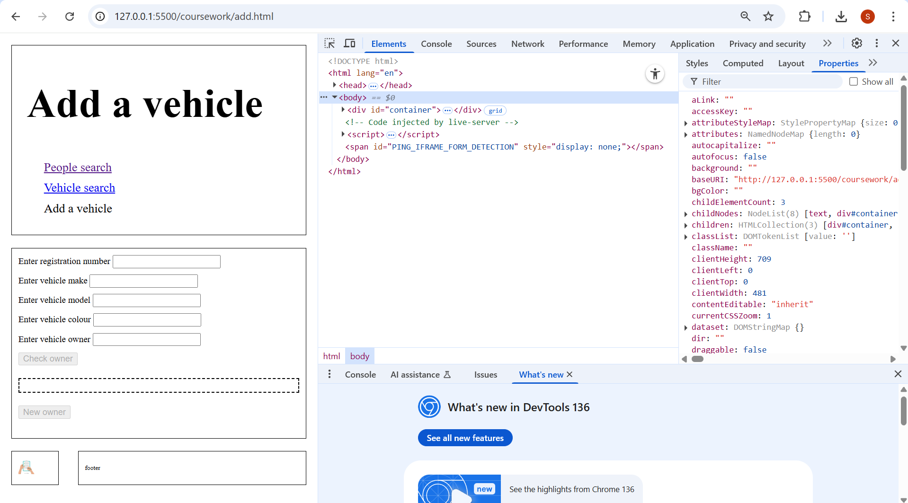

### HTML

###### Changes I made:
For my accesibility score I initially got 93.
I had successfully:
- given all my buttons names
- given all images alt text
- given a `<title>`
- given links names
- matched for with ids in forms

However I did not have 100 due to the navigation bar links being too close to eachother in the mobile/under 500px layout, so to fix this I created a new class called "links" in [style.css](style.css), lines 39-41, which added padding of 10px. I then added the separate `<li>` attributes to the class which you can see in [add.html](add.html), lines 18-21.

###### Tests:
[1004PWTests.ts](1004PWTests.spec.ts), lines 66-220.

### CSS
Pixel width: more than 500px

Pixel width: 499.26px

###### Code:
For changing the layout I split my layout further into a top row (lines 26-41 in [vehiclesearch.html](vehiclesearch.html)) and bottom row (lines 43-51 in [vehiclesearch.html](vehiclesearch.html)). The top row included the side bar and main content, and the bottom row included the footer and the side bar. However depending on which layout I adjusted which side bar is visible and the ratios of the rows (lines 123-199 in [style.css](style.css)).
###### Tests:
[1004PWTests.ts](1004PWTests.spec.ts), lines 223-373.

### JavaScript
I created PlayWright tests for the major exception types in my file [1004PWTests.ts](1004PWTests.spec.ts).

#### People Search:
|Test Number|Test/Feature tested|Conditions tested |Location (lines in file [1004PWTests.ts](1004PWTests.spec.ts))|Expected Output|
|----|---------------------|-------------------|---------------------------|-----------------|
|1|search "rachel" should return two records|People search (exact lowercase)|77–83|2 records, success message|
|2|search "ABCDEF" should return no records|People search with unknown name|85–89|0 records, 'No result found'|
|3|search "rachel" and "KWK24JI" should return error|Both name and license entered|91–96|Error message|
|4|search "" should return error|Empty fields when searched|98–103|Error message|
|5|search "RACHEL" should return two records|People search (uppercase)|105–111|2 records, success message|
|6|search "rach" should return two records|People search (partial match)|113–119|2 records, success message|

##### Vehicle Search:
|Test Number|Test/Feature tested|Conditions tested |Location (lines in file [1004PWTests.ts](1004PWTests.spec.ts))|Expected Output|
|----|---------------------|-------------------|---------------------------|-----------------|
|7|search "KWK24JI" should return tesla but no owner|Vehicle search with known rego|121–126|Tesla record, success message|
|8|search "kwk24ji" should return tesla but no owner|Vehicle search (lowercase rego)|128–133|Tesla record, success message|
|9|search "kwk2" should return tesla but no owner|Partial rego search|135–140|Tesla record, success message|
|10|search "ABCDEFG" should return No result found|Unknown rego search|142–147|0 results, message shown|
|11|search "" should return Error|No rego entered|149–154|Error message|

##### Add Vehicle:
|Test Number|Test/Feature tested|Conditions tested |Location (lines in file [1004PWTests.ts](1004PWTests.spec.ts))|Expected Output|
|----|---------------------|-------------------|---------------------------|-----------------|
|12|add a vehicle and owner|Add new vehicle with new owner (full process)|157–181|Owner and vehicle added successfully, when search for added owner, should appear|
|13|check button is disabled when owner field empty|Check owner button disabled when input is empty|183–187|Button is disabled|
|14|check a capital owner|Check owner (capital letters)|189–196|1 result, success message|
|15|check a partial owner|Check owner (partial name)|197–204|1 result, success message|
|16|add a vehicle existing owner|Vehicle added using existing owner|206–217|Vehicle added successfully|
|17|add a null field vehicle|One vehicle field missing (make)|219–225|Error message|
|18|add an existing owner|Duplicate owner insert attempt|227–239|Error message|
|19|add an owner with empty fields|Missing owner fields|241–254|Error message|

### Playwright Testing Issues
When I run the tests alltogether a test may fail. However when I then run that specific task again, alone, it passes. So if a test is failing that may be the issue. The database needs to be reset everytime the tests are ran as if not, tests inserting data will fail as the data will be a duplicate. So if a test needs to be reran that is inserting new data (tests: 12 & 16), changing the input data values will allow the tests to be reran as long as the data is not identical to any rows already in the database.
###### Commands
For the test file to work these commands need to be ran:
- npm install
- npx playwright test
